# Streaming Analytics

## Présentation du projet

Ce projet porte sur l'analyse et la visualisation des habitudes de visionnage de séries sur différentes plateformes de streaming.

L'objectif est d'explorer les données de visionnage afin d'identifier des tendances liées à la durée des sessions, aux horaires, aux jours, aux plateformes et aux genres de contenus.

## Objectifs

- Explorer et nettoyer les données de visionnage.
- Analyser la durée moyenne et totale de visionnage.
- Identifier les horaires de visionnage les plus fréquents.
- Comparer les habitudes de visionnage entre les différentes plateformes.
- Étudier la répartition des genres par plateforme.
- Analyser les habitudes selon les jours de la semaine et le week-end.
- Identifier les sessions de visionnage longues.
- Transformer les données en visualisations facilement interprétables.

## Technologies utilisées

- Python
- Pandas
- NumPy
- Matplotlib
- Seaborn
- CSV

## Structure du projet

```text
streaming-analytics/
│
├── code.py
├── visionnage_series.csv
├── resultats_analyse.csv
│
├── duree_moyenne.png
├── duree_moyenne_soir.png
├── duree_totale_plateforme.png
├── frequence_heures.png
├── heatmap_jour_heure.png
├── repartition_genres_disney+.png
├── repartition_genres_netflix.png
├── repartition_genres_prime_video.png
├── repartition_jours.png
├── sessions_longues.png
└── sessions_semaine_weekend.png
```

## Données

Le projet utilise un fichier CSV contenant les données de visionnage.

Les données permettent notamment d'étudier :

- les plateformes utilisées ;
- les genres de séries ;
- les horaires de visionnage ;
- les jours de visionnage ;
- la durée des sessions ;
- la fréquence des sessions.

Le fichier `resultats_analyse.csv` contient les résultats obtenus à partir des différentes analyses.

## Visualisations

### Durée moyenne de visionnage

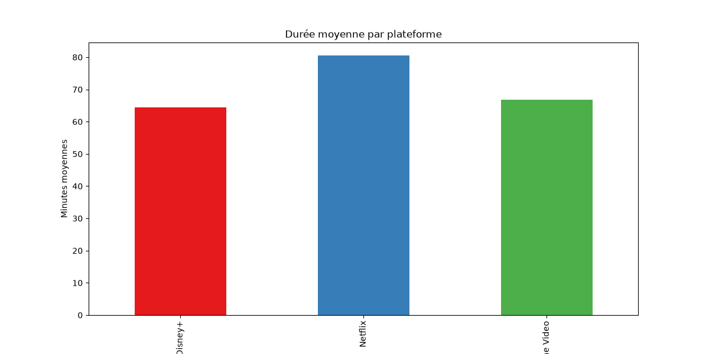

### Durée moyenne de visionnage le soir

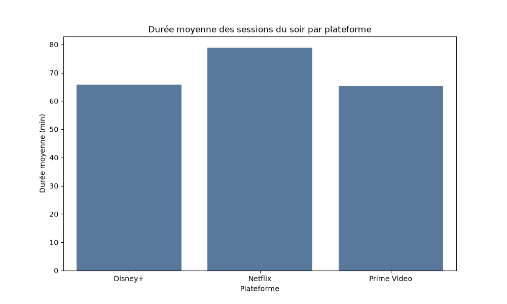

### Durée totale de visionnage par plateforme

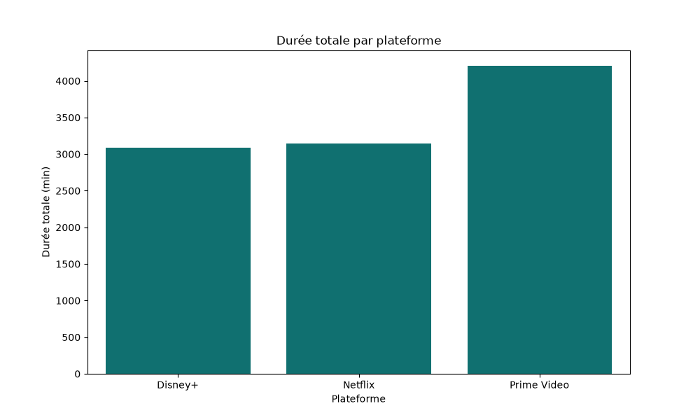

### Fréquence des heures de visionnage

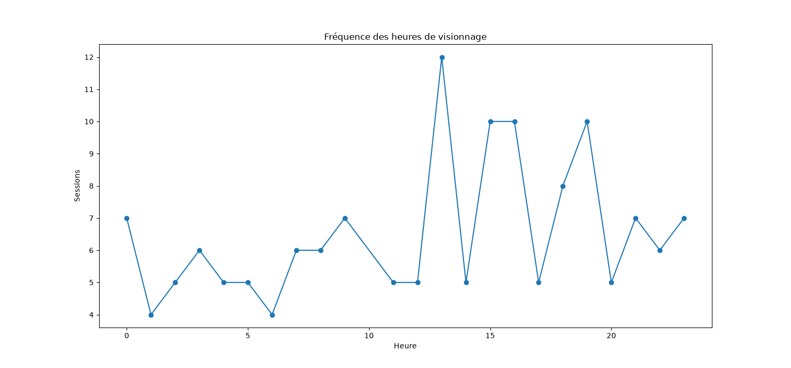

### Heatmap des jours et des heures

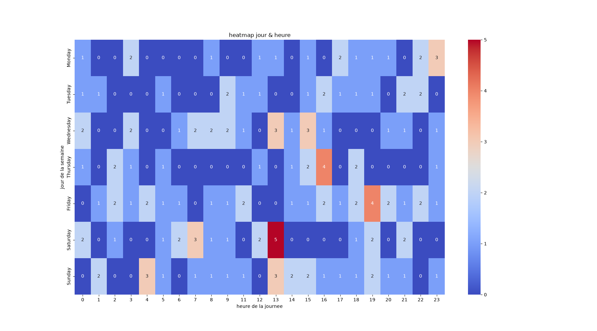

### Répartition des genres sur Disney+

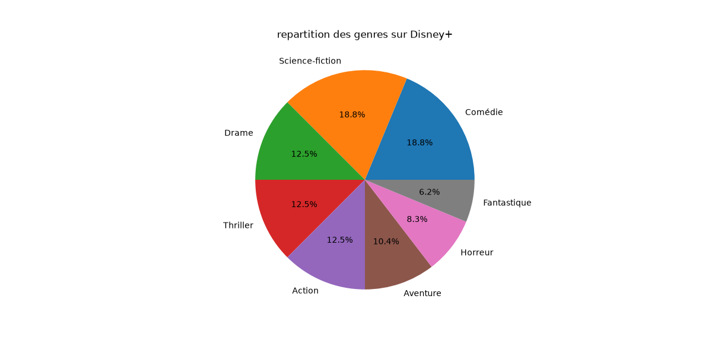

### Répartition des genres sur Netflix

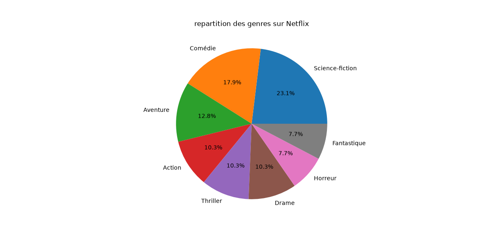

### Répartition des genres sur Prime Video

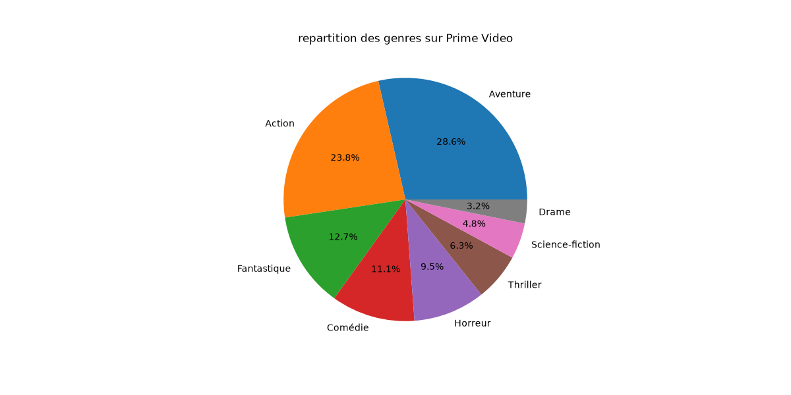

### Répartition des jours de visionnage

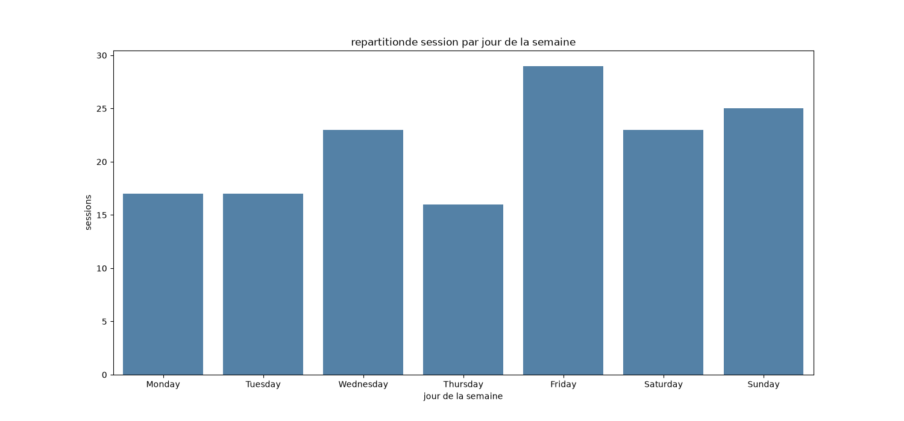

### Sessions de visionnage longues

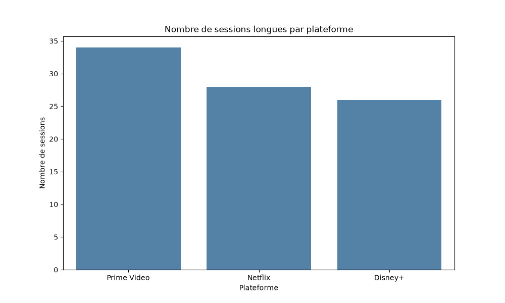

### Sessions en semaine et le week-end

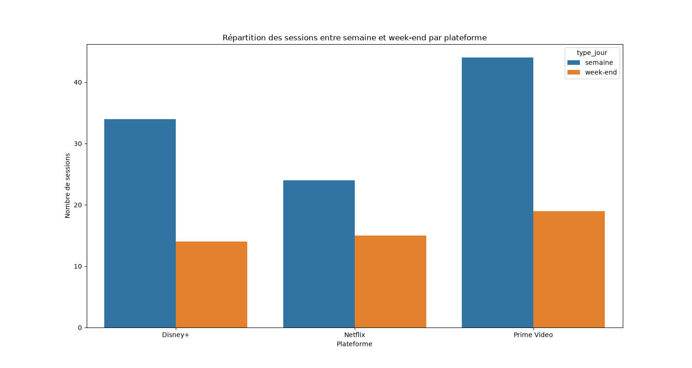

## Principaux résultats

L'analyse permet notamment de :

- comparer les durées de visionnage entre les plateformes ;
- identifier les horaires auxquels les sessions sont les plus fréquentes ;
- analyser la répartition des genres selon les plateformes ;
- observer les différences entre les habitudes de visionnage en semaine et le week-end ;
- identifier les sessions de visionnage particulièrement longues ;
- mettre en évidence les principales tendances présentes dans les données.

## Installation

Cloner le repository :

```bash
git clone <URL_DU_REPOSITORY>
cd streaming-analytics
```

Installer les bibliothèques nécessaires :

```bash
pip install pandas numpy matplotlib seaborn
```

## Exécution

Exécuter le script principal :

```bash
python code.py
```

Le script utilise les données présentes dans `visionnage_series.csv` et génère les résultats et visualisations associés.

## Résultats

Les analyses et visualisations permettent de transformer les données brutes de visionnage en indicateurs permettant de mieux comprendre les habitudes des utilisateurs selon les plateformes, les horaires, les jours et les genres.

## Compétences mobilisées

Ce projet met en pratique plusieurs compétences en analyse de données :

- Manipulation de données avec Pandas.
- Analyse exploratoire des données.
- Utilisation de NumPy.
- Création de visualisations avec Matplotlib et Seaborn.
- Analyse de données CSV.
- Interprétation de résultats.
- Communication des résultats à travers des visualisations.

## Auteur

Khadija Belbaraka

Data & AI | Python | SQL | Power BI | Machine Learning
